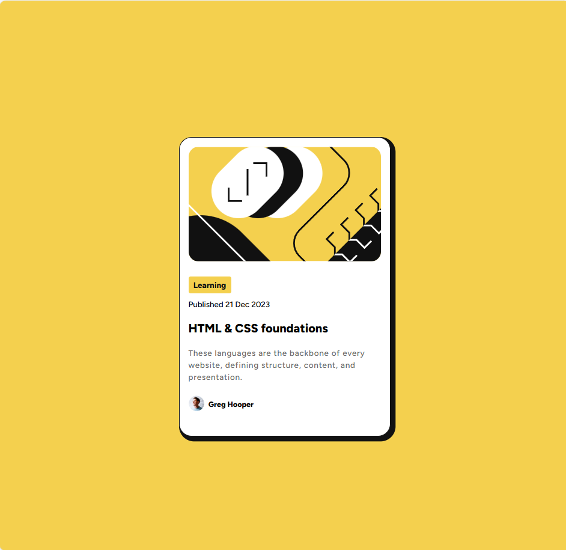

### Screenshot

### Links
- Solution URL: 
- Live Site URL: 
## My process
During the process I was able to specialize and develop my problem-solving skills in a more practical way. The process was long, but not very difficult. In the end, I learned a lot, gaining a better understanding of development with CSS and HTML.
### Built with

- Semantic HTML5 markup
- CSS custom properties
- Flexbox
- Hover
- FIGMA

### What I learned

I learned a lot from flexbox and understood the correct way to use FIGM, in addition to being able to use hover with ease. Before, I had a lot of difficulty using HTML and CSS, but after these projects I feel prepared for future learning with other languages ​​and programming logic.

### Continued development

In the future, I plan to master other programming languages ​​and incorporate AI correctly into my projects. I also plan to understand programming logic and continue developing projects.

## Author

- Website - [Lucas](https://lucky14518.github.io/desafio-cartao-blog/)
- Frontend Mentor - [@lucky14518](https://www.frontendmentor.io/profile/lucky14518)